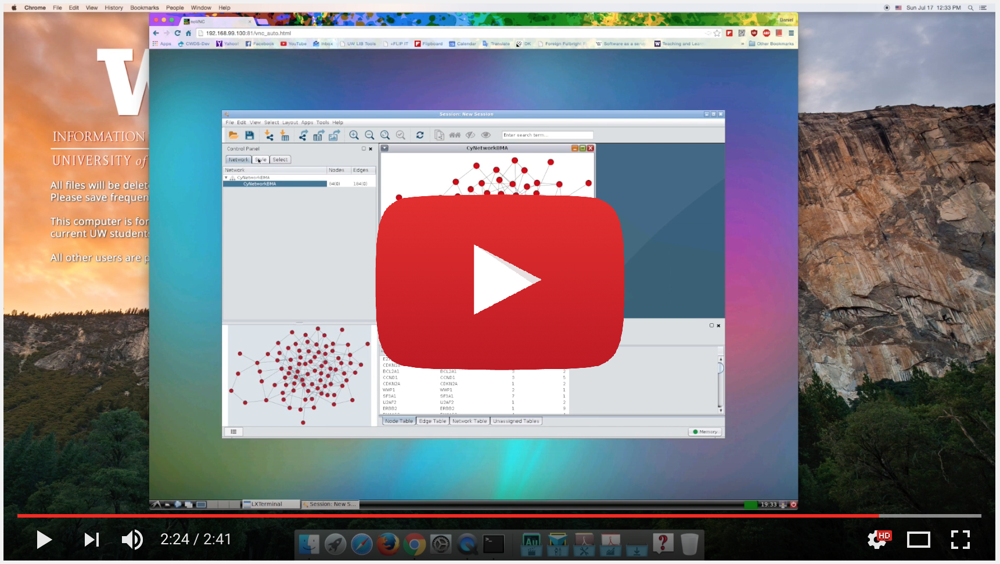

# noVNC-CyNetworkBMA

The purpose of this project is to address the issue of delivering graphical interface from Docker container. Our approach is by using the [noVNC](https://kanaka.github.io/noVNC/) solution, developed by Kanaka et.all.

Basically, noVNC is to use browser as VNC client to the running container, giving more freedom and flexibility on having graphical applications running as a docker package.

This package will get you: Cytoscape (a open source java application with GUI), R and Bioconductor, and CyNetworkBMA (a Cytoscape plug in to infer gene networks).

## Installing Docker
A more detailed on how to get running is available [here](https://docs.docker.com/engine/installation/)

## About CyNetworkBMA
CyNetworkBMA is a cytoscape plugin to infer gene networks using bayesian techniques. A more information about CynetworkBMA is available [here](http://www.ncbi.nlm.nih.gov/pubmed/26566394)

## Demo

[](https://www.youtube.com/embed/iaVPnLhOLg0)

## Running the container

This container was tested on various operating systems (MacOS, Windows, Linux) and various environtments (laptop/desktop, Microsoft Azure Cloud, Google Cloud, and AWS). 

In any docker-enabled environtment, the container can be run using following commands:

```
# Make sure to use the latest image
docker pull biodepot/novnc-cynetworkbma

#
docker run -v /Users/path/to/your/files:/data -d -p 80:6080 biodepot/novnc-cynetworkbma
```

Once run, use your favorite browser to interact with the container. To get the IP address of your docker, use following command:

```
# List of running docker machines
docker-machine ps
# Get the docker machine IP
docker-machine ip default
```


# Contact
You are invited to post a questions or sugesstion by pushing push request or sending 'issues' on this repo.
